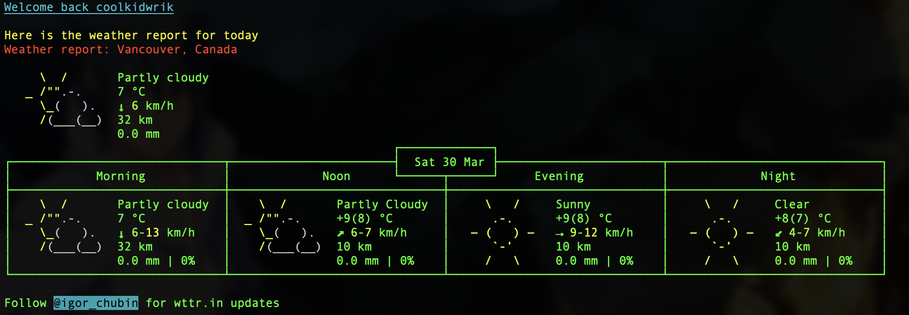

To use this, call startup.sh in your .zshrc or .bashrc file in your root directory. When opening up your shell for the first time, it will run the script.

here is how it looks when startup is run on open:

