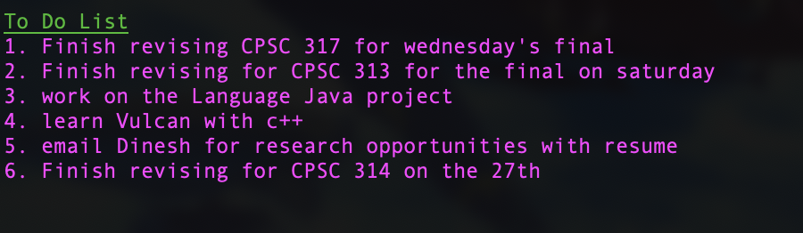
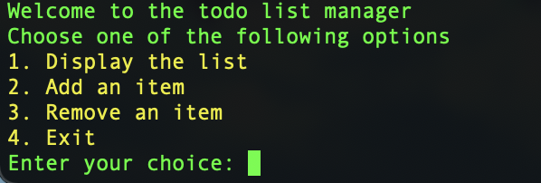
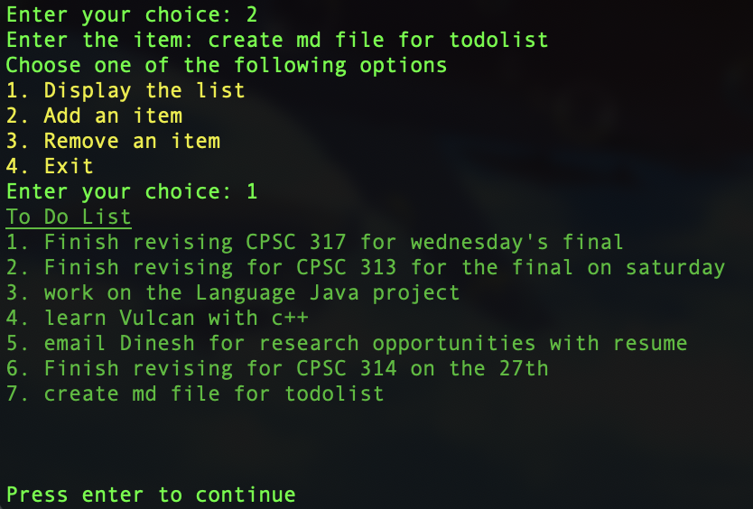

Todo list applications that runs directly on your shell. includes data persistence, so your list is retained even on your next login. This directory includes <a href="./list_todo.sh">list_todo.sh</a> which only prints the list to console. 

<a href="./list_todo.sh">todo.sh</a> enables users to interact with the list, including:
<ul>
    <li>adding items</li>
    <li>removing items</li>
    <li>listing items</li>
</ul>

Here is an example usage for adding an element to the list.

##
These commands can be aliased and run on open for shell, like with the startup package. 
<pre>
    <code>
        # can be added to .zshrc
        
        # ALIAS commands
        ###################################
        # modify my todo list. 
        #call todo from any directory to modify list
        alias todo="~/todo_list/todo.sh"

        # execute the following code on terminal startup
        ###################################
        # show the todo list as soon as terminal is opened
        ./startup/todo_list/list_todo.sh
    </code>
</pre>